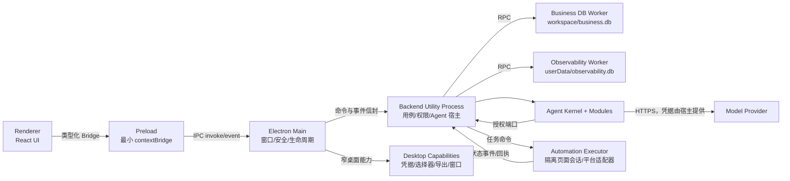

# Avery 项目架构设计

> 文档状态：目标架构基线
> 更新日期：2026-08-19
> 适用范围：Avery Windows 桌面端、Backend、Agent、自动化投递与本地数据层
> 依据：`AGENTS.md`、`docs/PRD.md`、`RECONSTRUCTION.md`、现有源码、数据库迁移和已恢复运行时

## 1. 文档目的

本文回答以下问题：

- 当前项目真实存在什么，哪些内容只是恢复出的编译产物。
- 后续源码应按什么进程、模块和目录组织。
- Renderer、Preload、Electron Main、Backend、DB Worker、Agent 与自动化投递之间如何通信。
- 依赖方向、数据所有权、安全边界和验证门禁是什么。
- 如何在不中断现有可运行基线的前提下迁移到目标架构。

本文描述目标架构，不代表目录树中的所有规划目录已经实现。涉及产品范围时以 `docs/PRD.md` 为准；涉及代码、安全、性能和执行规范时以 `AGENTS.md` 为最高约束。

## 2. 架构结论

Avery 采用“安全桌面壳 + 独立业务后端 + Worker 持久化 + 模块化 Agent + 隔离自动化执行器”的本地优先架构：

1. **Renderer 只负责界面和交互状态**，不得直接访问 Node.js、文件系统、数据库或模型服务。
2. **Preload 只暴露经过契约定义的最小桥接能力**，不承载业务规则。
3. **Electron Main 只负责窗口、生命周期、安全策略、系统凭据和桌面能力适配**，不执行数据库查询、模型循环或长时间计算。
4. **Backend Utility Process 负责用例编排、权限复核、Agent 宿主和业务一致性**，通过窄消息协议与 Main 通信。
5. **SQLite 与重型本地解析在 Worker 中执行**，避免阻塞 Main、Backend 事件循环和 Renderer。
6. **Agent Kernel 保持纯内核**，通过 SDK 定义的窄端口访问授权后的简历、档案和项目文件。
7. **自动化投递使用独立执行边界**，与通用 Agent 工具、普通 Renderer 和主业务数据库连接隔离；验证码、敏感问题和状态未知必须回到人工接管状态。
8. **`packages/contracts` 是跨进程协议的唯一来源**，所有请求、响应、事件、错误码和运行时校验从同一契约生成或引用。

## 3. 当前架构盘点

### 3.1 当前可维护源码

```text
project/
├─ src/                              # React Renderer TypeScript 源码
│  ├─ app/                           # 启动、壳层、路由和 UI 全局状态
│  ├─ features/                      # 助手、会话、简历、岗位、投递、档案、设置、开发者功能
│  ├─ shared/                        # 通用组件、平台客户端和工具
│  ├─ styles/                        # 全局样式与设计令牌
│  └─ types/                         # Renderer 局部类型
├─ packages/
│  ├─ contracts/src/                 # 跨进程 DTO、Bridge、错误码、Zod 写入校验
│  ├─ agent-sdk/src/                 # Agent 六槽接口、工具端口、事件和类型
│  ├─ agent-core/src/                # Agent 循环、取消、压缩熔断和工具调度
│  ├─ agent-module-host/src/         # 模块解析、版本校验和会话模块快照
│  └─ agent-modules-defaults/src/    # 默认 Provider、上下文、压缩、工具、交互和观测模块
├─ migrations/business/              # 业务数据库不可变迁移及 manifest
├─ public/                           # 随 Renderer 打包的稳定静态资源
├─ scripts/                          # 打包、安装生命周期和视觉冒烟脚本
└─ docs/                             # 产品、重建和架构文档
```

### 3.2 当前仅作为行为基准的运行时

```text
project/
├─ apps/backend/dist/                # 从运行包恢复的 Backend CommonJS
├─ apps/desktop/dist/                # 从运行包恢复的 Electron Main/Gateway/Adapters CommonJS
└─ electron/preload.cjs              # 当前可运行的 Preload Bridge
```

上述三个位置缺少对应的原始 TypeScript 源文件和原始构建配置。迁移完成前可以继续用于运行和对照测试，但必须遵守以下规则：

- 不把 `dist` 文件描述为原始源码。
- 不直接在 `dist` 中长期开发新功能。
- 每恢复一个 TypeScript 模块，都要与现有运行时做输入、结果信封、副作用和失败行为对照。
- 新构建产物覆盖旧 `dist` 前，必须保留可回退的行为基线。

### 3.3 已存在的关键边界

| 边界                 | 当前实现                                                                      | 结论                                   |
| ------------------ | ------------------------------------------------------------------------- | ------------------------------------ |
| Renderer → Preload | `window.averyAgent`、`window.averyWorkspace`、`window.averyWindow` | 保留命名空间，改为契约驱动并减少手工重复清单               |
| Preload → Main     | `ipcRenderer.invoke` 与单一 `agent:stream` 事件                                | 保留异步模型，禁止同步 IPC                      |
| Main → Backend     | `utilityProcess` 宿主与命令转发                                                  | 保留进程隔离；启动器最终归属 Desktop，而不是 Backend 包 |
| Backend → DB       | Business/Observability 两类 Worker RPC                                      | 保留 Worker 隔离和两个数据库的不同生命周期            |
| Backend → Agent    | `AgentHost` + 六槽模块 + 窄 Tool Ports                                         | 保留纯 Kernel 与宿主授权边界                   |
| 数据并发               | revision、资源锁、幂等记录、Saga 恢复                                                 | 作为所有新增写路径的强制基础设施                     |

### 3.4 当前缺口

- `apps/backend` 与 `apps/desktop` 的清单声明了 TypeScript 构建，但当前只有 `dist`，尚不能独立从源码重建。
- Renderer 仍位于根 `src/`，与 workspace 应用目录不一致；在恢复运行时源码后再迁移，避免同时改变入口和行为。
- Preload、Bridge 类型、路由表和 Renderer 平台客户端存在多处人工维护清单，后续容易发生通道漂移。
- 当前简历 DTO 仍以 `summary + content` 为主，尚未达到 PRD 要求的结构化模块、来源和编辑命令模型。
- 自动化投递、视觉服务和完整的场景权限模型属于目标能力，不能按现有普通业务 CRUD 或通用 Agent 工具直接扩展。
- 测试目前以构建与发布冒烟脚本为主，仍需补齐单元、契约、集成、安全和端到端测试目录。

## 4. 目标进程拓扑



### 4.1 通信规则

- 所有跨进程命令都使用稳定的请求信封，至少包含 `requestId`、`channel`、`payload` 和协议版本。
- 所有响应都使用 `ResultEnvelope<T>`；业务失败返回稳定错误码，不跨边界抛裸异常。
- 流式事件必须包含 `requestId`，会话相关事件还必须包含 `sessionId`；迟到事件不得写入其他会话。
- Main 对 Renderer 来源、通道、负载大小、频率和可序列化性进行第一层校验，Backend 在执行前进行第二层 Schema 与权限校验。
- 文件、附件和项目只跨边界传递虚拟 ID/URI；物理绝对路径只允许存在于持有该能力的进程内。
- Main 与 Backend 不提供同步 IPC；CPU 密集、数据库和大文件解析必须转交 Worker 或专用执行器。

## 5. 目标目录架构

下面是目标目录。标记含义：`[保留]` 为现有结构继续使用，`[迁移]` 为现有能力迁回 TypeScript 或移动位置，`[新增]` 为需求实现时创建，不要求一次性生成空目录。

```text
project/
├─ apps/
│  ├─ renderer/                                      # [迁移] React 渲染进程
│  │  ├─ src/
│  │  │  ├─ app/                                    # 应用组合根、Provider、路由、启动恢复
│  │  │  ├─ features/
│  │  │  │  ├─ assistant/                           # 会话 UI、流事件、场景与确认交互
│  │  │  │  ├─ conversation/                        # 会话查询与消息持久化适配
│  │  │  │  ├─ resume/                              # 结构化简历、版本、预览、导出入口
│  │  │  │  ├─ profile/                             # 事实档案与外部修改冲突
│  │  │  │  ├─ job/                                 # 岗位库与 JD
│  │  │  │  ├─ application/                         # 投递记录与阶段管理
│  │  │  │  ├─ automation/                          # 投递任务状态、暂停与人工接管 UI
│  │  │  │  ├─ settings/                            # 引导、模型、权限与本地设置
│  │  │  │  └─ developer/                           # 本地日志、Trace 与 Usage
│  │  │  ├─ shared/
│  │  │  │  ├─ components/                          # 无业务含义的通用组件
│  │  │  │  ├─ platform/                            # Renderer 唯一 Bridge 客户端
│  │  │  │  ├─ hooks/                               # 跨 feature 的纯 UI hook
│  │  │  │  └─ utils/                               # 无副作用工具
│  │  │  ├─ styles/                                 # Token、全局样式、响应式规则
│  │  │  └─ main.tsx                                # Renderer 唯一入口
│  │  ├─ index.html
│  │  ├─ tsconfig.json
│  │  └─ vite.config.ts
│  │
│  ├─ desktop/                                       # [迁移] Electron Main 组合根
│  │  ├─ src/
│  │  │  ├─ main.ts                                 # 应用生命周期唯一入口
│  │  │  ├─ bootstrap/                              # 组合 BackendHost、Gateway 与能力适配器
│  │  │  ├─ window/                                 # 主窗口创建、导航策略、窗口控制
│  │  │  ├─ security/                               # 权限拒绝、CSP、外链和 sender 校验
│  │  │  ├─ ipc/                                    # Gateway、限流、负载上限、事件转发
│  │  │  ├─ backend-host/                           # Utility Process 启停、退避和健康状态
│  │  │  ├─ capabilities/
│  │  │  │  ├─ credential/                          # safeStorage，唯一明文 Key 接触边界
│  │  │  │  ├─ filesystem/                          # 原生选择器与已授权路径句柄
│  │  │  │  ├─ export/                              # 用户主动触发的 PDF/Word/图片导出
│  │  │  │  └─ diagnostics/                         # 用户主动导出的脱敏诊断包
│  │  │  └─ automation-host/                        # [新增] 隔离页面会话与执行器生命周期
│  │  ├─ preload/
│  │  │  ├─ index.ts                                # 普通应用窗口的最小 Bridge
│  │  │  └─ automation.ts                           # [新增] 自动化窗口专用窄 Bridge
│  │  ├─ package.json
│  │  └─ tsconfig.json
│  │
│  ├─ backend/                                       # [迁移] Utility Process 业务后端
│  │  ├─ src/
│  │  │  ├─ index.ts                                # Utility Process 入口，不导入 Electron UI API
│  │  │  ├─ bootstrap/                              # 依赖装配与启动恢复
│  │  │  ├─ transport/                              # 命令路由、事件出口、信封与幂等
│  │  │  ├─ modules/
│  │  │  │  ├─ workspace/                           # 工作空间健康、迁移、备份、恢复 Saga
│  │  │  │  ├─ conversation/                        # 会话、消息与运行快照
│  │  │  │  ├─ resume/                              # 结构化简历、版本、锁与编辑命令
│  │  │  │  ├─ profile/                             # 事实档案、证据与冲突检测
│  │  │  │  ├─ job/                                 # 岗位与不可变岗位快照
│  │  │  │  ├─ application/                         # 投递记录、阶段事件与简历版本引用
│  │  │  │  ├─ assistant/                           # AgentHost、场景授权、Session 状态
│  │  │  │  ├─ automation/                          # [新增] 投递任务、规则、幂等和审计编排
│  │  │  │  ├─ attachment/                          # 内容寻址、引用和延迟清理
│  │  │  │  ├─ settings/                            # 非敏感设置
│  │  │  │  └─ developer/                           # Trace/Usage 查询与留存设置
│  │  │  ├─ ports/                                  # DB、文件、凭据、模型、桌面、自动化窄端口
│  │  │  ├─ infrastructure/
│  │  │  │  ├─ persistence/                         # Worker RPC Client 与仓储适配器
│  │  │  │  ├─ files/                               # 项目过滤、附件读取、文档解析
│  │  │  │  └─ providers/                           # Provider/视觉服务传输适配
│  │  │  └─ workers/
│  │  │     ├─ business/                            # 业务 SQLite 连接与迁移
│  │  │     ├─ observability/                       # Trace/日志 SQLite 连接
│  │  │     └─ document/                            # [按需] OCR/文档解析重任务
│  │  ├─ package.json
│  │  └─ tsconfig.json
│  │
│  └─ automation/                                    # [新增] 独立自动化页面执行包
│     ├─ src/
│     │  ├─ runtime/                                 # 暂停、继续、接管、停止状态机适配
│     │  ├─ page-bridge/                             # 固定命令，不接受任意脚本字符串
│     │  └─ platform-adapters/                       # 按平台版本化的字段与页面适配器
│     ├─ package.json
│     └─ tsconfig.json
│
├─ packages/
│  ├─ contracts/                                     # [保留] 跨进程协议唯一来源
│  │  └─ src/
│  │     ├─ common/                                  # 信封、错误码、分页和版本
│  │     ├─ agent/                                   # Agent 命令、事件、Usage 与场景 DTO
│  │     ├─ workspace/                               # 工作空间、备份与恢复 DTO
│  │     ├─ resume/                                  # 结构化简历及编辑命令 Schema
│  │     ├─ recruitment/                             # 岗位、投递和自动化任务 Schema
│  │     └─ bridge/                                  # 命名空间与方法注册表
│  ├─ agent-sdk/                                     # [保留] 模块接口和最小工具端口
│  ├─ agent-core/                                    # [保留] 无 Node/Electron/业务状态的纯内核
│  ├─ agent-module-host/                             # [保留] 六槽解析、兼容性和快照
│  ├─ agent-modules-defaults/                        # [保留] 官方默认六槽实现
│  ├─ automation-core/                               # [新增] 无 Electron 依赖的投递任务状态机
│  ├─ file-policy/                                   # [新增] 统一路径、敏感文件和读取配额策略
│  └─ test-kit/                                      # [新增] 契约 fixture、内存端口和确定性时钟
│
├─ migrations/
│  ├─ business/                                      # [保留] 业务数据库迁移，只增不改
│  └─ observability/                                 # [新增] 观测库迁移，替代运行时 ALTER 探测
├─ tests/
│  ├─ unit/                                          # 纯函数、状态机、权限和领域规则
│  ├─ contract/                                      # Bridge/Router/Preload 方法及 Schema 一致性
│  ├─ integration/                                   # SQLite、迁移、Worker RPC、Provider mock
│  ├─ security/                                      # 路径逃逸、敏感文件、IPC 来源和脱敏
│  ├─ e2e/                                           # Electron 核心旅程与失败恢复
│  ├─ visual/                                        # 1280×800、1024×680 和拖动边界
│  ├─ performance/                                   # 启动、页面反馈、附件与导出基线
│  └─ fixtures/                                      # 无真实凭据和个人数据的测试资料
├─ docs/
│  ├─ ARCHITECTURE.md                                # 本文
│  ├─ architecture/
│  │  ├─ decisions/                                  # ADR：关键架构决策及替代方案
│  │  ├─ contracts/                                  # IPC、事件和错误码说明
│  │  ├─ data/                                       # 数据模型、迁移、备份与恢复
│  │  └─ security/                                   # 威胁模型与权限矩阵
│  └─ modules/                                       # PRD 所列专项模块设计
├─ scripts/                                          # [保留] 构建、打包、发布和冒烟入口
├─ public/                                           # [迁移后归 apps/renderer/public]
├─ build/                                            # 打包输入资源，不保存生成包
├─ package.json                                      # workspace 与统一命令
├─ package-lock.json                                 # 干净安装后生成并提交
├─ tsconfig.base.json                                # [新增] 各 workspace 共享严格配置
└─ electron-builder.config.ts                        # [新增] 从 package.json 分离发布配置
```

### 5.1 目录落地原则

- 不为了匹配目录树而一次性创建空包；只有当代码、测试和所有者明确时才新增 workspace。
- 第一阶段保持根 `src/`、`public/`、`index.html` 和 `vite.config.ts` 可运行；待 Desktop/Backend TypeScript 重建稳定后，再原样迁移到 `apps/renderer`。
- `apps/*/dist`、`packages/*/dist`、根 `dist`、`release-*` 都是生成物，不作为模块引用源和人工编辑入口。
- `apps/backend/src/modules/*` 按业务能力纵向组织。一个模块拥有自己的用例、规则和端口；跨模块调用通过公开服务或事件，不直接访问对方仓储内部。
- 只有确实被多个运行时复用的纯逻辑才进入 `packages/*`，避免把所有代码过早拆成包。

## 6. 模块职责与依赖方向

### 6.1 允许的依赖

| 来源                 | 允许依赖                                                       | 禁止依赖                                         |
| ------------------ | ---------------------------------------------------------- | -------------------------------------------- |
| `apps/renderer`    | React、React Query、`@avery/contracts`、Renderer shared    | Node/Electron、Backend 实现、SQLite、Provider SDK |
| Desktop Preload    | Electron `contextBridge/ipcRenderer`、`@avery/contracts` | 业务 Service、数据库、任意文件系统入口                      |
| `apps/desktop`     | Electron、`@avery/contracts`、桌面能力适配器                     | Renderer feature、业务仓储、Agent Kernel 内部状态      |
| `apps/backend`     | Contracts、Agent 包、Backend ports/infrastructure             | React、DOM、BrowserWindow、Renderer store       |
| DB/Document Worker | Worker 协议、对应 Store/Parser、最小原生依赖                           | Electron UI、Renderer、跨库直接连接                  |
| `agent-core`       | `agent-sdk` 类型和注入端口                                        | Node、Electron、业务数据库、凭据、具体 Provider           |
| `automation-core`  | 自身状态与契约类型                                                  | Electron、DOM、平台选择器实现、业务数据库                   |
| `apps/automation`  | Automation contracts、受控页面能力                                | 主业务仓储、Agent 任意工具、凭据导出                        |

依赖总体保持单向：

```text
UI → Contracts ← Desktop / Backend / Automation
Backend → Agent Host → Agent SDK ← Agent Core / Agent Modules
Backend → Ports ← Infrastructure / Workers / Desktop Capabilities
Automation Runtime → Automation Core → Contracts
```

### 6.2 Renderer 规则

- `features/<name>/pages` 只做页面组合；业务请求集中在该 feature 的 `api`，交互状态在 `model`。
- 页面不得直接访问 `window.avery*`；所有调用经过 `shared/platform`。
- feature 之间只通过各自 `index.ts` 的公开 API 或 app 层编排，禁止深层相互导入。
- 服务端事实由 React Query 管理；纯 UI 状态由局部 state 或 UiStore 管理，不复制一份长期业务实体缓存。
- 大型页面继续拆为 `components`、`model` 和 `api`，避免页面文件同时处理流协议、持久化和展示。

### 6.3 Backend 模块规则

- Transport 只做协议解析、身份/权限上下文建立、路由和结果归一化。
- Module Service 负责编排用例、事务、revision、幂等、审计和补偿；不能依赖 Renderer 状态。
- Repository 只负责持久化映射，不包含跨实体业务流程。
- Infrastructure 实现端口；调用方依赖端口而不是具体 Worker Client、文件系统或 Provider。
- 写操作必须显式携带 actor、资源 ID、期望 revision 和幂等键；高风险操作还要携带授权依据。
- 所有删除优先逻辑删除或可恢复操作；真正清理由可审计的生命周期任务完成。

### 6.4 Agent 规则

- 六槽顺序继续固定为 Model Provider、Context Builder、Compaction、Tools、Interaction、Observability。
- 场景在 Backend 中解析为不可变的运行快照：System Prompt、工具白名单、数据范围必须一起冻结。
- Tool Module 只能看见当前场景允许的窄端口；不得增加 Shell、任意网络、投递提交、任意路径读写等通用能力。
- 文件读取、简历写入和档案写入在端口实现处再次校验，不能只相信工具参数或前端按钮。
- Provider 返回的 Usage 是用户展示与 Trace 的事实源；本地估算只用于压缩预判或明确标记的诊断值。

### 6.5 自动化投递规则

- 自动化是独立业务域，不等同于 Agent 工具调用。Agent 可以提出投递计划，但不能绕过自动化权限状态机直接提交。
- `automation-core` 定义至少以下状态：`prepared`、`running`、`waiting_confirmation`、`waiting_takeover`、`paused`、`submitted`、`failed`、`unknown`、`cancelled`。
- 每一步保存任务 ID、岗位快照、简历版本、字段来源、置信度、平台适配器版本和审计事件。
- 页面执行器只接受版本化的固定命令，不接受来自模型或 Backend 的任意 JavaScript 字符串。
- 自动提交授权与简历“无需确认”分开存储；验证码、二次认证、敏感问题、重复投递风险和未知提交状态始终强制暂停。
- `unknown` 状态禁止自动重试提交，必须由用户核对结果后恢复。

## 7. 契约设计

### 7.1 单一来源

`packages/contracts` 同时提供：

- TypeScript DTO 与 Bridge 方法类型。
- Zod 请求/响应/事件 Schema。
- 稳定错误码、是否可重试及可公开的错误详情类型。
- Bridge 命名空间、方法名、IPC channel 和协议版本注册表。

Desktop Gateway、Preload 暴露对象、Backend Router 和契约测试必须引用同一注册表。禁止分别手写四份通道清单。

### 7.2 命令命名

保持现有外部 channel 兼容，新增能力采用：

```text
<domain>:<resource>-<action>
```

例如：

- `resume:edit-preview`
- `resume:edit-confirm`
- `automation:task-start`
- `automation:task-pause`
- `automation:task-takeover`

对已经发布的 channel，迁移通过兼容适配器完成，不直接改名导致 Renderer 和运行时同时失效。

### 7.3 错误与事件

- Renderer 只依据错误码选择 UI，不解析英文异常文本。
- 内部错误在 Backend 记录脱敏 Trace，对 Renderer 返回可操作的中文信息与有限诊断字段。
- 事件使用可判别联合类型；未知事件版本被记录并忽略，不能让页面崩溃。
- 完成、取消、失败和暂停是互斥终态/阶段事件，状态转换由后端状态机验证。

## 8. 数据架构与所有权

| 数据                   | 存储位置                                | 所有者                           | 关键约束                             |
| -------------------- | ----------------------------------- | ----------------------------- | -------------------------------- |
| 会话、简历、岗位、投递、设置、自动化任务 | `<workspace>/avery.db`           | Business DB Worker            | 迁移、事务、revision、审计、备份             |
| 档案事实                 | `<workspace>/profile.json`，后续可迁入业务库 | Profile 模块                    | 原子写、内容哈希、外部修改冲突                  |
| 附件                   | `<workspace>/attachments/<sha256>`  | Attachment 模块                 | 内容寻址、虚拟 URI、引用计数/墓碑              |
| 导出文件                 | 用户主动选择的位置                           | Desktop Export Capability     | Agent 不得直接触发或获取真实路径              |
| API Key              | Electron `safeStorage` 保护的用户数据文件    | Desktop Credential Capability | 不进入业务库、日志、Trace、备份和 Renderer 持久态 |
| Trace 与日志            | `<userData>/observability.db`       | Observability Worker          | 与工作空间分离、脱敏、数量/时间留存               |
| 项目授权                 | Backend 私有授权表/句柄                    | Assistant/Workspace 模块        | Renderer 只见 projectId 和名称，不见绝对路径 |
| 自动化页面会话              | Desktop 管理的隔离 session partition     | Automation Host               | 不导出密码，不与普通窗口共享任意 Bridge          |

### 8.1 数据一致性

- 一个业务用例只允许一个事务提交点；跨数据库或文件系统操作使用 Saga 和补偿记录。
- 业务数据库迁移文件只新增，不修改已发布版本；manifest checksum 必须验证。
- 所有可变实体使用 revision；前端提交旧 revision 时返回冲突，不静默覆盖。
- 简历写入同时受资源锁与 revision 保护；Agent 和用户编辑走同一写端口。
- 投递记录固定引用实际提交时的岗位快照与简历版本，不跟随后续编辑变化。
- 备份恢复先验证 manifest、checksum、Schema 版本和档案文件，再原子切换；未知高版本只读打开。

## 9. 安全架构

### 9.1 Electron 基线

- 保持 `contextIsolation: true`、`nodeIntegration: false`、`sandbox: true`。
- 默认拒绝权限请求、新窗口和非预期导航；外链通过受控桌面能力打开。
- 生产 Renderer 使用严格 CSP，不允许 `unsafe-eval`；开发策略单独配置且不进入生产包。
- IPC 校验发送窗口、frame、origin、channel、Schema、负载大小和速率。
- Preload 每个方法映射一个固定 channel，不暴露原始 `ipcRenderer`、文件系统或通用 invoke。

### 9.2 文件与项目环境

- 使用 `projectId`、`attachment://` 等虚拟引用，所有路径在持有授权的 Backend 端解析。
- 解析后执行 canonical path 与根目录包含校验，拒绝 `..`、符号链接逃逸和路径替换竞态。
- `.gitignore`、内置敏感规则、用户排除项、扩展名、单文件和总量限制同时生效。
- `.env`、密钥、证书、Token、数据库、日志、依赖和构建目录不可由普通场景解除排除。
- 文档解析和 OCR 在 Worker 中执行，设定超时、内存/页数/像素限制并清理临时文件。

### 9.3 外部服务

- 文本与视觉 Provider 分别配置、分别授权、分别存储凭据。
- 网络请求只能由对应 Provider Adapter 发起；工具和 Renderer 不拥有任意网络能力。
- 发送前最小化上下文，Trace 写入前统一脱敏 Authorization、Key、疑似凭据和绝对路径。
- 未返回 Usage 时标记为 `unavailable`，不得使用估算值冒充真实数据。

## 10. 性能与可靠性策略

- Main 启动只创建安全策略、能力适配器、Backend Host 和首个窗口；非首屏能力延迟加载。
- SQLite 继续使用 WAL，但连接只存在于对应 Worker；Backend 通过异步 RPC 访问。
- Renderer 初始只加载应用壳和当前路由，大型开发者 Trace、自动化和导出 UI 按路由懒加载。
- 附件、PDF、Word、OCR、备份校验和大规模文件枚举均进入 Worker，并提供进度和取消。
- Backend Host 使用有界重启与退避；连续失败进入明确恢复态，禁止无限重启掩盖根因。
- 每项性能修改记录基线设备、数据规模、命令和修改前后结果；不得只以主观感受验收。

## 11. 测试与发布门禁

### 11.1 测试分层

| 层级          | 必测内容                                                             |
| ----------- | ---------------------------------------------------------------- |
| Unit        | 状态机、revision、权限矩阵、路径策略、Usage、压缩、脱敏、映射函数                          |
| Contract    | Contracts 注册表、Preload 方法、Gateway channel、Backend Router、事件联合完全一致 |
| Integration | SQLite 迁移/事务/恢复、Worker 崩溃、文件 Saga、Provider mock、模块加载失败           |
| Security    | IPC 来源伪造、超大负载、路径逃逸、敏感文件、凭据/Trace 泄漏、自动化越权                        |
| E2E         | 引导、会话、结构化简历、岗位、投递、暂停接管、备份恢复和升级                                   |
| Visual      | 1280×800、1024×680、侧栏拖动、紧凑输入区和关键错误态                               |
| Performance | 冷启动、路由反馈、附件解析、备份、导出和停止响应                                         |

### 11.2 合并门禁

每个受影响 workspace 至少通过：

1. TypeScript 严格类型检查。
2. 对应单元与契约测试。
3. 受影响的集成测试。
4. 根构建。
5. 涉及 Electron、数据库或 UI 时的对应冒烟测试。

涉及安装包时额外执行目录包、NSIS、隔离安装、升级、卸载保留数据、图标与发布清单验证。

## 12. 分阶段迁移计划

### 阶段 A：固定行为基线

- 保存当前可运行目录包、关键流程输入输出和 SHA-256。
- 为现有 Bridge、Router、数据库迁移、生命周期和恢复流程补契约/冒烟测试。
- 生成可重复的 `package-lock.json`，验证干净环境 `npm ci`。

**退出条件**：任何迁移失败都能回到当前可运行版本，并能判断行为是否变化。

### 阶段 B：恢复 Desktop 与 Backend TypeScript

- 先恢复 Backend `transport`、Worker Host 和组合根，再恢复 Service、Repository 和 AgentHost。
- 将 Electron `utilityProcess` 启动器从 Backend 边界迁到 Desktop `backend-host`。
- 恢复 Desktop Main、Gateway、Adapters 和 Preload TypeScript。
- 每迁移一个文件就删除其 `@ts-nocheck` 来源，执行类型、契约与行为对照测试。

**退出条件**：`apps/backend/dist`、`apps/desktop/dist` 和 Preload 均由仓库内 TypeScript 构建生成。

### 阶段 C：统一契约与 Renderer 位置

- 拆分 Contracts 子域并引入运行时 Schema 和唯一 Bridge 注册表。
- Gateway、Router、Preload 和 platformClient 改为消费统一注册表。
- 在行为不变的前提下将根 Renderer 迁到 `apps/renderer`，同步调整 Vite 与 Electron Builder 输入。

**退出条件**：根构建包含三个源码应用；不存在人工维护的重复 channel 清单。

### 阶段 D：实现产品目标数据模型

- 先完成结构化简历 Schema、编辑命令、来源引用、版本与冲突模型，再迁移现有 `content` 数据。
- 补齐档案证据、场景权限快照、真实 Usage 和项目授权策略。
- 每次数据迁移包含备份、前向迁移、失败恢复和旧数据 fixture。

**退出条件**：PRD 的结构化简历、事实来源、确认模式和会话恢复有完整自动化验收。

### 阶段 E：隔离自动化与视觉服务

- 先实现 `automation-core` 状态机、任务幂等和审计，再接入独立页面执行器和少量平台适配器。
- 视觉服务使用独立 Provider Adapter、凭据和授权流程，不与文本模型隐式共用。
- 辅助投递通过专项安全测试后，才评估开放受限的全自动提交。

**退出条件**：暂停、接管、全局停止、未知状态、重复提交和敏感问题门禁全部通过。

### 阶段 F：清理恢复兼容层

- 删除不再被构建引用的恢复产物和兼容适配器前，先归档基线并确认发布包来自源码。
- 收紧 package files，仅打包运行必需产物、迁移和资源。
- 完成架构依赖检查、发布验收和 ADR 收口。

**退出条件**：干净环境可安装、构建、测试、打包和安装运行，且源码目录是唯一实现来源。

## 13. 架构决策记录清单

后续在 `docs/architecture/decisions/` 维护 ADR，至少记录：

1. Electron Main 与 Backend Utility Process 的职责分界。
2. Business DB 与 Observability DB 分库原因。
3. 跨文件/数据库操作采用 Saga 而非分布式事务。
4. Agent 六槽和场景权限快照模型（已建立 [Agent ADR 索引](./architecture/decisions/README.md)）。
5. 结构化简历编辑命令与版本模型。
6. 自动化执行器隔离、页面适配器和 session partition 策略。
7. 项目文件授权、敏感过滤与虚拟 URI。
8. Bridge 注册表和协议版本兼容策略。

每份 ADR 必须包含上下文、决策、替代方案、正负影响、迁移与回退方式。

## 14. 架构变更检查表

提交新增模块或跨进程能力前确认：

- 能否放在现有边界内，是否真的需要新 workspace 或新进程。
- 数据和副作用的唯一所有者是谁。
- 是否新增跨进程契约、运行时 Schema、稳定错误码和协议版本。
- 是否在执行端复核权限，而非只隐藏前端按钮。
- 是否可能阻塞 Main、Renderer 或 Backend 事件循环。
- 是否涉及凭据、绝对路径、个人信息、外部网络或自动提交。
- 是否定义幂等、revision、取消、超时、失败恢复和审计。
- 是否补齐对应层级测试、基线数据和回退方案。
- 是否更新本架构文档或相关 ADR。

## 15. 总结

Avery 的目标不是把所有能力堆进 Electron 主进程，而是建立可验证的最小权限链路：Renderer 发起意图，Preload 暴露固定能力，Main 执行桌面安全边界，Backend 编排业务与权限，Worker 持有数据库和重任务，Agent 与自动化只能通过受控端口执行。当前最优先工作不是扩展新功能，而是先把已恢复的 Desktop、Backend 和 Preload 运行时重建为可重复构建的 TypeScript 源码；此后再迁移 Renderer、结构化简历和自动化投递，才能在保留现有可运行基线的同时实现 PRD 的安全、数据一致性与可维护性目标。
